# 1학기 관통PJT : MovieTalk

## 팀 이름 : 이재용빠

### 팀원 구성 및 업무 분담 내역

- 이용훈(팀장) : 실시간 채팅, Database 생성, 영화 검색, 기본 UI/UX 디자인

- 이재상 : 소셜 로그인 기능, 추천 알고리즘을 활용한 영화 추천 기능, AWS를 활용한 배포

- 그외 회원, 리뷰, 댓글 관련 기능 및 DB 모델링 등은 Driver-Navigator 방식의 공동 작업

  

### 협업 방식

#### 1. 이슈 트랙킹 + 일정 관리 : Trello

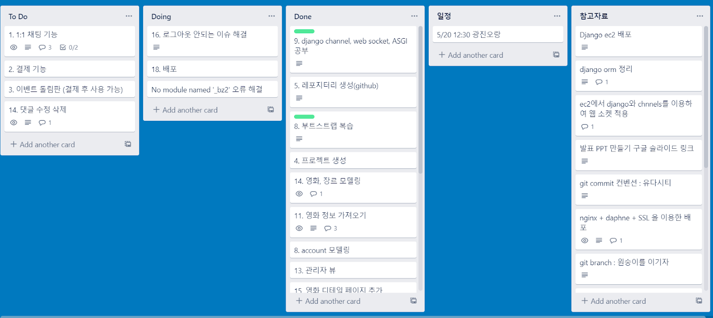

#### 2. Git Commit Convention : Udacity

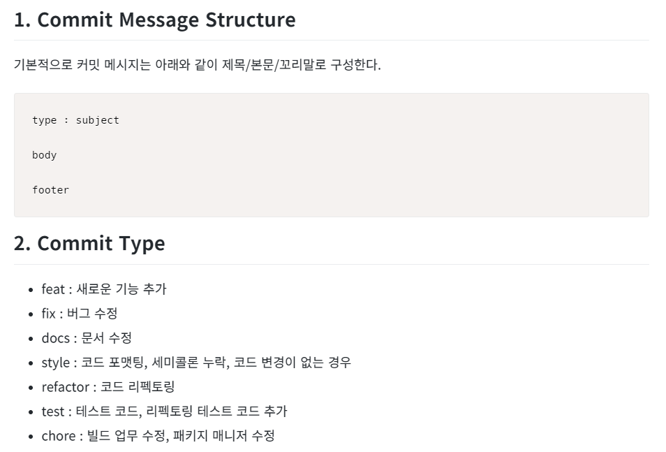


## 배포 서버 URL

- `http://13.59.14.71`


## 기능 구현

1. 기본 명세(유저 생성, 수정, 탈퇴 + 영화 정보 제공 + 리뷰 생성 및 삭제, 수정 + 댓글 생성 등)
2. 실시간 채팅
3. 영화 추천 알고리즘
4. 소셜 로그인
5. 영화 검색

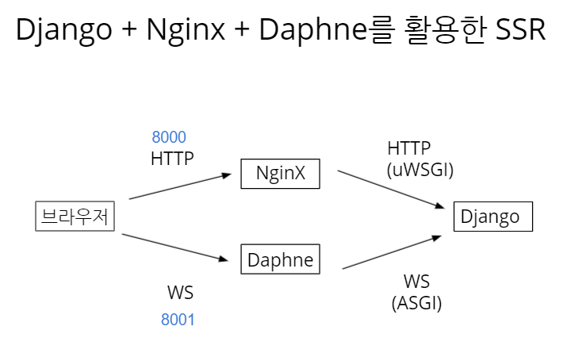

### Product Concept

```
컨텐츠 기반의 추천 알고리즘으로 영화 추천 받고

영화에 관해 다양한 사람들과 실시간으로 대화를 나눠보자!

```


### ERD

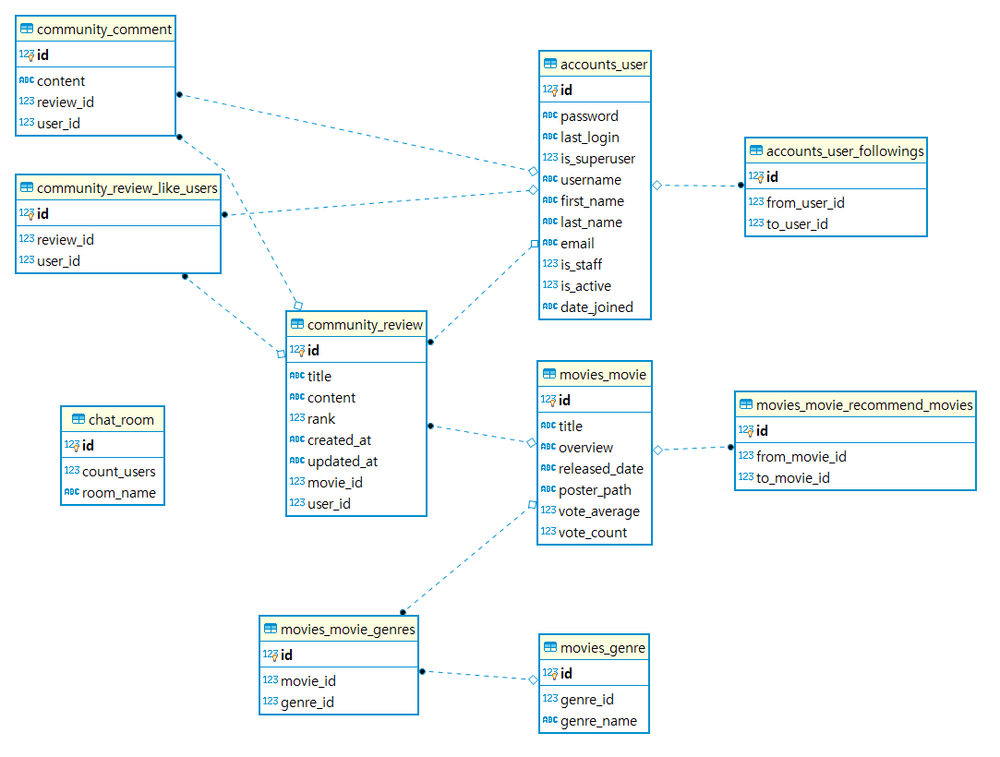

### 기술 스택

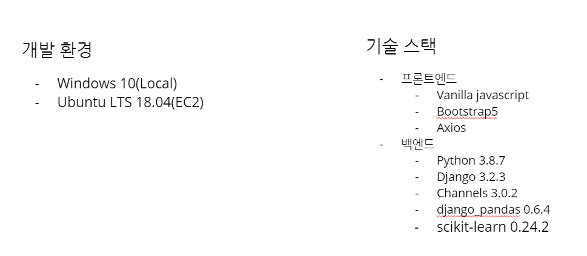


### 화면구성

#### 1. 메인화면 

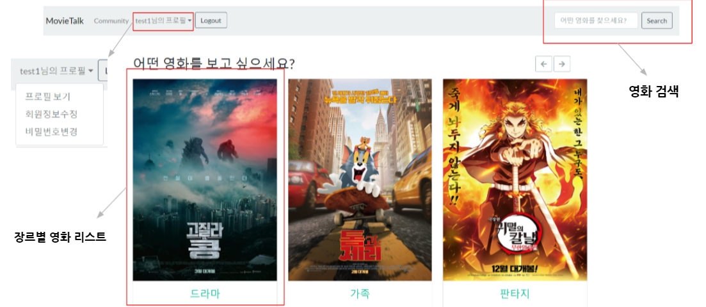

#### 2. 장르별 영화

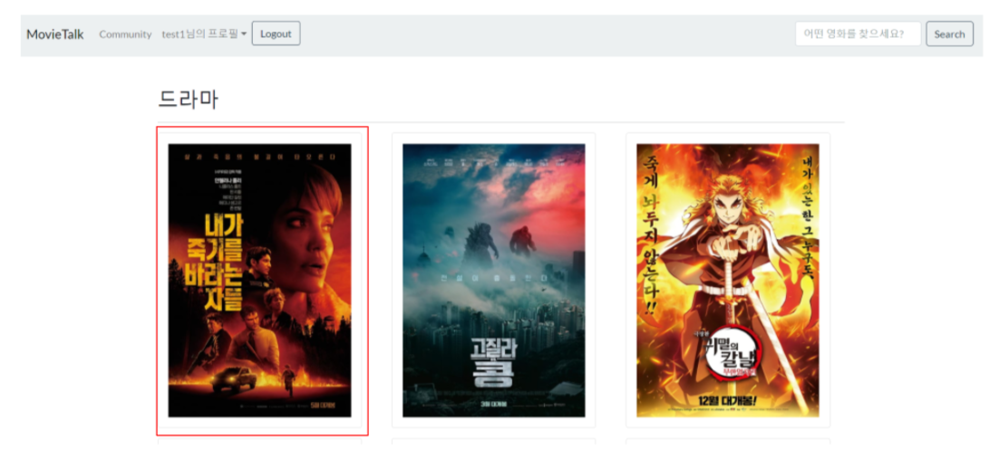

#### 3. 영화 세부 정보

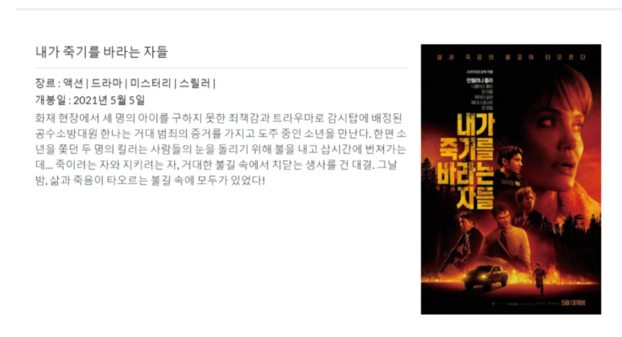

#### 4. 영화 리뷰 및 추천 정보

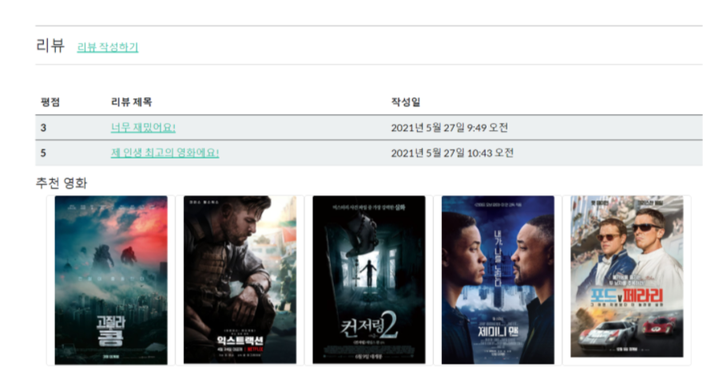

#### 5. 리뷰 세부 정보

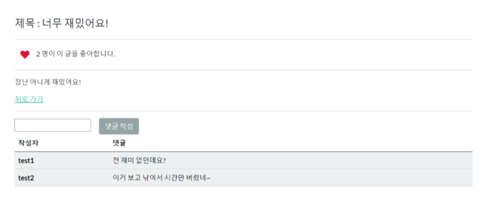

#### 6. 로그인

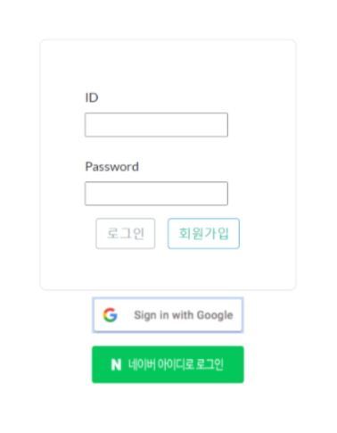

#### 7. 실시간 채팅

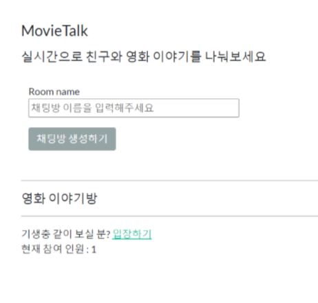

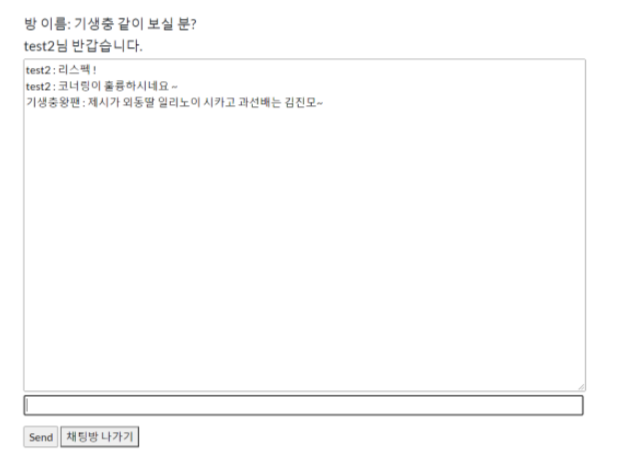

#### 상세 기능 구현 설명

##### 1. 실시간 채팅

- Django Channels와 HTML5 WebSockets 활용
- ASGI와 AsyncWebsocketConsumer를 활용하여 비동기 실시간 채팅 서버 구현
- 본래 서버가 여러 대일 경우 인메모리를 사용하게 되면 데이터의 일관성이 깨지고 채팅방이 많고 이용 유저가 많으면 속도가 매우 느려지는 문제가 있어서, 테스트/개발단계가 아니라면 Channel layers로 Redis를 사용할 것을 권장하나, 아래와 같은 이유에서 인메모리를 사용
   1. Redis의 Channels 라이브러리와의 버전 충돌 이슈와 배포 문제
      - redis 최신 버전을 설치시 통신 오류가 발생하는데, 이를 해결하려면 channels-redis를 2.x 버전을 사용하면 문제가 해결이 되었다.
      - 하지만 channels-redis를 2.x 버전으로 설치하면 channels도 2.x 버전으로 자동 설치되는데, routing에 사용하는 메소드인 as_asgi()가 2.x버전에서는 동작하지 않는다. 억지로 channels의 3.x 버전을 따로 또 설치를 하게 되면 의존성 문제가 발생한다는 경고가 뜬다.
    2. 프로토타입의 성격이 강한 점
    3. 단일 서버를 운용한다는 점
 - 한계
    - 채팅방 이름, 참여 인원 등을 저장하는 Channel Layers에서 Redis를 사용하지 못하고 서버 자체 메모리를 사용했으며, 채팅방 관련 정보를 Sqlite3에 저장하여 활용
    - 채팅방의 참여 인원이 0이 되면 채팅방을 삭제하고 웹소켓을 닫는 형태로 구현하고, 채팅방 링크를 타고 들어갔을 때 채팅방 참여인원의 값을 증가시키는 형태로 구현하였는데, 
      	1. 채팅방 참여 인원을 직접 User 객체를 Counting하지 않고 별도 Integer로 관리한다는 점
       	2. 이 때문에 해당 채팅방에서 동일 유저가 새로고침을 하여도 참여인원이 한 명 늘어나버린다는 점 등의 문제가 존재

##### 2. 영화 검색

- Django의 Q 객체 활용

  - Django Model ORM으로 where 절에 or, not, and 등의 조건을 추가할 때 사용

  - Title이나 Overview에 검색 단어가 있으면 결과를 보여주고, 결과가 없으면 자체 추천 영화를 제시

    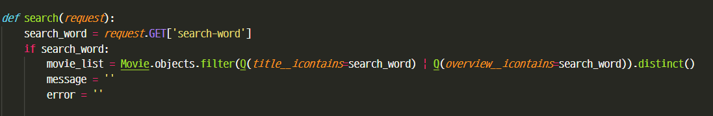


##### 3. 추천 알고리즘


##### 4. 소셜 로그인


##### 5. 배포

- 배포 관련 이슈
  - Channels를 사용할 때 Daphne라는 일종의 프로토콜 서버를 사용할 수 있어서 웹소켓 프로토콜 뿐만 아니라 HTTP 요청도 받을 수 있어서 따로 웹서버를 두지 않아도 된다고 공식 문서에는 나와있었으나, collect static이 불안정한 이슈가 있어서 Nginx를 일종의 Reverse Proxy 서버로 두고 HTTP 요청은 Nginx와 uWSGI가, 그외 요청은 Daphne와 ASGI가 처리할 수 있도록 하였음
  - 로컬 개발 환경이었던 Windows10에서 channels 라이브러리를 설치하게 되면 Windows 환경에서 비동기 작업을 수행하기 위하여 IOCP 관련 라이브러리(twisted-icopsupport)가 설치된다. 그런데 배포에 활용된 EC2 서버는 Ubuntu LTS 18.04를 OS를 사용하고 있었고, IOCP는 Windows에서만 사용되기 때문에 requirements.txt를 설치할 때 존재하지 않는 라이브러리를 설치하려고 해서 에러가 발생한다. 그래서 이 부분을 제외하고 pip install 해줘야한다. (배포 서버용 requirements.txt를 만들어서 해결)


## 기타 - 느낀 점

1. 수업 때 배웠던 내용이 아닌 것들을 공식 문서와 인터넷 자료들을 뒤져가며 만들었는데. 제대로 구현이 안되었던 것들이 많았지만 어느 정도 결과물을 만들어낼 수 있어서 자신감을 갖게 되었다. 그리고 이 과정에서 웹서버, WAS, CGI, ASGI, WSGI, 비동기 서버 구현 등에 관해 몰랐던 지식들을 얻을 수 있었다.
2. 자바스크립트에서 많이 마주하였던 콜백 함수의 형태는 다른 언어에서 람다 함수, 함수 객체, 함수 포인터 등의 형태로 적극적으로 활용되는 것을 많이 보았는데, 아직 그 구조의 이해도가 낮아서 활용하기가 어렵다. 많이 연습해볼 필요성을 느꼈다.
3. 지금까지 프로젝트에서는 DB ERD가 주어져있던 경우가 대다수였는데, 이번 프로젝트에서는 모델링부터 진행을 하여야 했다. 처음에 이 부분이 오래 걸릴거라고 생각하지 못하였는데, 일대일, 일대다, 다대다 관계를 설정하는 방법, Join table에 데이터를 넣고, 데이터를 가져오는 방법 등을 이해하는데 꽤 시간이 많이 걸렸다.

